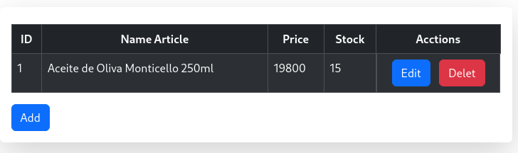

# Registro de productos 
Este es un crud que permite crear, leer, actulizar y eliminar productos.
Esta aplicación está construida con las siguientes tecnologías:
- HTML
- Bootstrap
- JavaScript

La aplicación se conecta a una API creada con NodeJs y MySql.

## Tabla vacia

## Registrando el primer producto
 

## Mostrando todos los registros

## Editando un registro

## Eliminando un producto

## Agregando otro producto (Id auto incremental y único)
